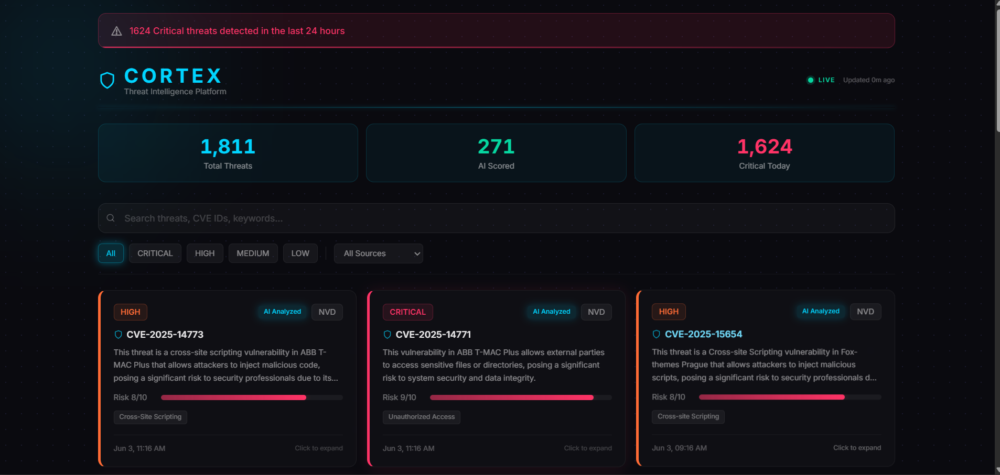
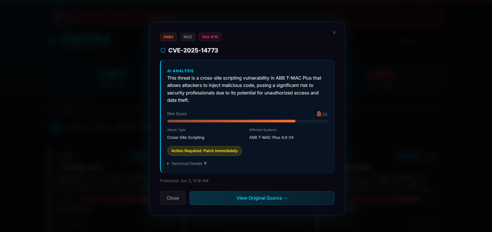

# CORTEX — Cyber Threat Intelligence Platform

A real-time threat intelligence pipeline that collects cybersecurity threats from 6 sources, scores them with Groq AI, and displays everything on a live dashboard. Built by a solo developer, runs for free on GitHub Actions + Vercel + Supabase free tier.

**Live demo:** [cortex-threat-intelligence.vercel.app](https://cortex-threat-intelligence.vercel.app)

## Screenshots




## How It Works

<svg width="100%" viewBox="0 0 680 580" role="img" xmlns="http://www.w3.org/2000/svg">
<title>Cortex Threat Intelligence Platform — end-to-end architecture</title>
<desc>Flowchart showing data flow from 5 sources through collection, Supabase storage, Groq AI scoring, and out to the website dashboard and Telegram alerts</desc>
<defs>
<marker id="arrow" viewBox="0 0 10 10" refX="8" refY="5" markerWidth="6" markerHeight="6" orient="auto-start-reverse">
<path d="M2 1L8 5L2 9" fill="none" stroke="context-stroke" stroke-width="1.5" stroke-linecap="round" stroke-linejoin="round"/>
</marker>
</defs>

<!-- Sources row -->
<g>
  <rect x="20" y="30" width="100" height="44" rx="8" stroke-width="0.5" style="fill:rgb(8, 80, 65);stroke:rgb(93, 202, 165);"/>
  <text x="70" y="48" text-anchor="middle" dominant-baseline="central" style="fill:rgb(159, 225, 203);font-size:14px;font-weight:500">NVD CVE</text>
  <text x="70" y="64" text-anchor="middle" dominant-baseline="central" style="fill:rgb(93, 202, 165);font-size:12px">API</text>
</g>
<g>
  <rect x="138" y="30" width="100" height="44" rx="8" stroke-width="0.5" style="fill:rgb(8, 80, 65);stroke:rgb(93, 202, 165);"/>
  <text x="188" y="48" text-anchor="middle" dominant-baseline="central" style="fill:rgb(159, 225, 203);font-size:14px;font-weight:500">CISA KEV</text>
  <text x="188" y="64" text-anchor="middle" dominant-baseline="central" style="fill:rgb(93, 202, 165);font-size:12px">Catalog</text>
</g>
<g>
  <rect x="256" y="30" width="100" height="44" rx="8" stroke-width="0.5" style="fill:rgb(8, 80, 65);stroke:rgb(93, 202, 165);"/>
  <text x="306" y="48" text-anchor="middle" dominant-baseline="central" style="fill:rgb(159, 225, 203);font-size:14px;font-weight:500">Hacker News</text>
  <text x="306" y="64" text-anchor="middle" dominant-baseline="central" style="fill:rgb(93, 202, 165);font-size:12px">RSS</text>
</g>
<g>
  <rect x="374" y="30" width="100" height="44" rx="8" stroke-width="0.5" style="fill:rgb(8, 80, 65);stroke:rgb(93, 202, 165);"/>
  <text x="424" y="48" text-anchor="middle" dominant-baseline="central" style="fill:rgb(159, 225, 203);font-size:14px;font-weight:500">AlienVault</text>
  <text x="424" y="64" text-anchor="middle" dominant-baseline="central" style="fill:rgb(93, 202, 165);font-size:12px">OTX feed</text>
</g>
<g>
  <rect x="492" y="30" width="100" height="44" rx="8" stroke-width="0.5" style="fill:rgb(8, 80, 65);stroke:rgb(93, 202, 165);"/>
  <text x="542" y="48" text-anchor="middle" dominant-baseline="central" style="fill:rgb(159, 225, 203);font-size:14px;font-weight:500">NCSC / JPCERT</text>
  <text x="542" y="64" text-anchor="middle" dominant-baseline="central" style="fill:rgb(93, 202, 165);font-size:12px">RSS</text>
</g>

<text x="630" y="55" text-anchor="middle" dominant-baseline="central" style="fill:rgb(194, 192, 182);font-size:12px">Sources</text>

<!-- Arrows from sources to collector -->
<line x1="70" y1="74" x2="70" y2="138" marker-end="url(#arrow)" style="fill:none;stroke:rgb(156, 154, 146);stroke-width:1.5px"/>
<line x1="188" y1="74" x2="188" y2="138" marker-end="url(#arrow)" style="fill:none;stroke:rgb(156, 154, 146);stroke-width:1.5px"/>
<line x1="306" y1="74" x2="306" y2="138" marker-end="url(#arrow)" style="fill:none;stroke:rgb(156, 154, 146);stroke-width:1.5px"/>
<line x1="424" y1="74" x2="424" y2="138" marker-end="url(#arrow)" style="fill:none;stroke:rgb(156, 154, 146);stroke-width:1.5px"/>
<line x1="542" y1="74" x2="542" y2="138" marker-end="url(#arrow)" style="fill:none;stroke:rgb(156, 154, 146);stroke-width:1.5px"/>

<!-- Collector -->
<g>
  <rect x="80" y="138" width="460" height="56" rx="8" stroke-width="0.5" style="fill:rgb(12, 68, 124);stroke:rgb(133, 183, 235);"/>
  <text x="310" y="158" text-anchor="middle" dominant-baseline="central" style="fill:rgb(181, 212, 244);font-size:14px;font-weight:500">GitHub Actions — feed collector</text>
  <text x="310" y="178" text-anchor="middle" dominant-baseline="central" style="fill:rgb(133, 183, 235);font-size:12px">Runs every 6 hours · batch upsert · deduplication by URL</text>
</g>

<!-- Arrow to Supabase -->
<line x1="310" y1="194" x2="310" y2="258" marker-end="url(#arrow)" style="fill:none;stroke:rgb(156, 154, 146);stroke-width:1.5px"/>

<!-- Supabase -->
<g>
  <rect x="130" y="258" width="360" height="56" rx="8" stroke-width="0.5" style="fill:rgb(60, 52, 137);stroke:rgb(175, 169, 236);"/>
  <text x="310" y="278" text-anchor="middle" dominant-baseline="central" style="fill:rgb(206, 203, 246);font-size:14px;font-weight:500">Supabase PostgreSQL</text>
  <text x="310" y="296" text-anchor="middle" dominant-baseline="central" style="fill:rgb(175, 169, 236);font-size:12px">1,800+ threats · severity · source · raw data</text>
</g>

<!-- Arrow to Groq scorer -->
<line x1="310" y1="314" x2="310" y2="378" marker-end="url(#arrow)" style="fill:none;stroke:rgb(156, 154, 146);stroke-width:1.5px"/>

<!-- Groq scorer -->
<g>
  <rect x="130" y="378" width="360" height="56" rx="8" stroke-width="0.5" style="fill:rgb(99, 56, 6);stroke:rgb(239, 159, 39);"/>
  <text x="310" y="398" text-anchor="middle" dominant-baseline="central" style="fill:rgb(250, 199, 117);font-size:14px;font-weight:500">Groq AI scorer</text>
  <text x="310" y="416" text-anchor="middle" dominant-baseline="central" style="fill:rgb(239, 159, 39);font-size:12px">Risk score · plain English summary · action required</text>
</g>

<!-- Arrows to outputs -->
<line x1="220" y1="434" x2="160" y2="498" marker-end="url(#arrow)" style="fill:none;stroke:rgb(156, 154, 146);stroke-width:1.5px"/>
<line x1="400" y1="434" x2="460" y2="498" marker-end="url(#arrow)" style="fill:none;stroke:rgb(156, 154, 146);stroke-width:1.5px"/>

<!-- Website output -->
<g>
  <rect x="40" y="498" width="230" height="56" rx="8" stroke-width="0.5" style="fill:rgb(39, 80, 10);stroke:rgb(151, 196, 89);"/>
  <text x="155" y="518" text-anchor="middle" dominant-baseline="central" style="fill:rgb(192, 221, 151);font-size:14px;font-weight:500">Live dashboard</text>
  <text x="155" y="536" text-anchor="middle" dominant-baseline="central" style="fill:rgb(151, 196, 89);font-size:12px">Next.js · Vercel · public</text>
</g>

<!-- Telegram output -->
<g>
  <rect x="390" y="498" width="230" height="56" rx="8" stroke-width="0.5" style="fill:rgb(113, 43, 19);stroke:rgb(240, 153, 123);"/>
  <text x="505" y="518" text-anchor="middle" dominant-baseline="central" style="fill:rgb(245, 196, 179);font-size:14px;font-weight:500">Telegram alerts</text>
  <text x="505" y="536" text-anchor="middle" dominant-baseline="central" style="fill:rgb(240, 153, 123);font-size:12px">Critical threats · coming soon</text>
</g>
</svg>

1. A scheduled GitHub Actions workflow runs `python main.py` every 6 hours
2. It fetches fresh threats from all 6 sources
3. New threats are upserted into Supabase (deduplicated by URL)
4. Groq AI analyzes any unscored Critical/High threats — assigns risk score, summary, attack type, affected systems, action required, and India relevance
5. The Next.js dashboard queries Supabase and shows everything with real-time search, filtering, and pagination

## Data Sources

| Source | What it provides |
|--------|-----------------|
| **NVD CVE API** | All published CVEs with CVSS scores |
| **CISA KEV** | Known exploited vulnerabilities catalog |
| **The Hacker News** | Cybersecurity news articles via RSS |
| **NCSC UK** | UK National Cyber Security Centre advisories |
| **JPCERT** | Japan CERT English-language threat alerts |
| **AlienVault OTX** | Community-contributed threat pulses (API key required) |

~1,700+ threats collected and growing.

## AI Scoring

Every Critical and High severity threat gets analyzed by Groq's `llama-3.3-70b-versatile` model. The AI generates:

- **Risk score** (1–10) with color-coded severity
- **Plain English summary** — what the threat is and why it matters
- **Attack type** — RCE, phishing, DoS, data breach, etc.
- **Affected systems** — which software or infrastructure is impacted
- **Action required** — immediate patch, monitor, or no action
- **India relevance** — whether the threat affects infrastructure commonly used in India

Unscored threats show a "AI Analysis Pending" state in the UI — the pipeline picks them up on the next run.

## Quick Start

```bash
# Backend
pip install -r requirements.txt
cp .env.example .env   # add Supabase URL/key, Groq key, OTX key
python main.py          # collect + score + summary

# Frontend
cd cortex-web
npm install
npm run dev
```

### Required keys
- **Supabase** — free at supabase.com (URL + service_role key for backend, anon key for frontend)
- **Groq** — free API key at console.groq.com
- **OTX** — optional, free at otx.alienvault.com (skips if not set)

## Project Structure

```
├── cortex/
│   ├── collectors/feed_collector.py    # 6 source collectors
│   ├── database/supabase_client.py     # batch upsert + queries
│   ├── ai/scorer.py                    # Groq AI analysis
│   └── config/settings.py             # env var loader
├── cortex-web/                         # Next.js 16 dashboard
│   └── app/page.tsx                   # full dashboard UI
├── main.py                             # CLI entry point
└── .github/workflows/pipeline.yml     # 6-hour cron automation
```

## Roadmap

What's actually coming next (in rough priority order):

- **Telegram alerts** — bot integration for instant critical threat notifications
- **India filter** — dedicated view for India-relevant threats only
- **CVE trend charts** — simple visualizations showing threat volume over time
- **Public API** — REST endpoint to query the threat database

No vaporware, no "AI SOC Assistant" promises. These are features I actually want and will build.

## A Note

I built this because I wanted a free, automated way to track cybersecurity threats without relying on paid feeds or vendor dashboards. The stack is deliberately simple — no Docker, no FastAPI, no Streamlit, no SQLAlchemy. Just Python collecting data, Supabase storing it, and a Next.js page showing it.

If you're a security researcher or just someone who wants to understand what threats are out there, the live site should be useful as-is. The code is open source, the pipeline runs itself, and the AI summaries make even complex CVEs readable. That was the whole point.

— Solo dev, 2026
