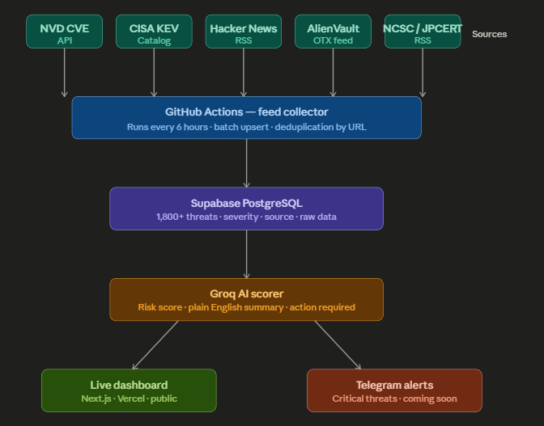

# CORTEX — Cyber Threat Intelligence Platform

A real-time threat intelligence pipeline that collects cybersecurity threats from 6 sources, scores them with Groq AI, and displays everything on a live dashboard. Built by a solo developer, runs for free on GitHub Actions + Vercel + Supabase free tier.

**Live demo:** [cortex-threat-intelligence.vercel.app](https://cortex-threat-intelligence.vercel.app)

## Screenshots


<br>


<br>



1. A scheduled GitHub Actions workflow runs `python main.py` every 6 hours
2. It fetches fresh threats from all 6 sources
3. New threats are upserted into Supabase (deduplicated by URL)
4. Groq AI analyzes any unscored Critical/High threats — assigns risk score, summary, attack type, affected systems, action required, and India relevance
5. The Next.js dashboard queries Supabase and shows everything with real-time search, filtering, and pagination

## Data Sources

| Source | What it provides |
|--------|-----------------|
| **NVD CVE API** | All published CVEs with CVSS scores |
| **CISA KEV** | Known exploited vulnerabilities catalog |
| **The Hacker News** | Cybersecurity news articles via RSS |
| **NCSC UK** | UK National Cyber Security Centre advisories |
| **JPCERT** | Japan CERT English-language threat alerts |
| **AlienVault OTX** | Community-contributed threat pulses (API key required) |

~1,700+ threats collected and growing.

## AI Scoring

Every Critical and High severity threat gets analyzed by Groq's `llama-3.3-70b-versatile` model. The AI generates:

- **Risk score** (1–10) with color-coded severity
- **Plain English summary** — what the threat is and why it matters
- **Attack type** — RCE, phishing, DoS, data breach, etc.
- **Affected systems** — which software or infrastructure is impacted
- **Action required** — immediate patch, monitor, or no action
- **India relevance** — whether the threat affects infrastructure commonly used in India

Unscored threats show a "AI Analysis Pending" state in the UI — the pipeline picks them up on the next run.

## Quick Start

```bash
# Backend
pip install -r requirements.txt
cp .env.example .env   # add Supabase URL/key, Groq key, OTX key
python main.py          # collect + score + summary

# Frontend
cd cortex-web
npm install
npm run dev
```

### Required keys
- **Supabase** — free at supabase.com (URL + service_role key for backend, anon key for frontend)
- **Groq** — free API key at console.groq.com
- **OTX** — optional, free at otx.alienvault.com (skips if not set)

## Project Structure

```
├── cortex/
│   ├── collectors/feed_collector.py    # 6 source collectors
│   ├── database/supabase_client.py     # batch upsert + queries
│   ├── ai/scorer.py                    # Groq AI analysis
│   └── config/settings.py             # env var loader
├── cortex-web/                         # Next.js 16 dashboard
│   └── app/page.tsx                   # full dashboard UI
├── main.py                             # CLI entry point
└── .github/workflows/pipeline.yml     # 6-hour cron automation
```

## Roadmap

What's actually coming next (in rough priority order):

- **Telegram alerts** — bot integration for instant critical threat notifications
- **India filter** — dedicated view for India-relevant threats only
- **CVE trend charts** — simple visualizations showing threat volume over time
- **Public API** — REST endpoint to query the threat database

No vaporware, no "AI SOC Assistant" promises. These are features I actually want and will build.

## A Note

I built this because I wanted a free, automated way to track cybersecurity threats without relying on paid feeds or vendor dashboards. The stack is deliberately simple — no Docker, no FastAPI, no Streamlit, no SQLAlchemy. Just Python collecting data, Supabase storing it, and a Next.js page showing it.

If you're a security researcher or just someone who wants to understand what threats are out there, the live site should be useful as-is. The code is open source, the pipeline runs itself, and the AI summaries make even complex CVEs readable. That was the whole point.

— Solo dev, 2026
